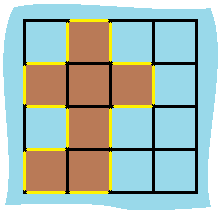

# Island Perimeter

## Problem Statement

You are given a `row x col` grid representing a map where:

- `grid[i][j] = 1` represents **land**.
- `grid[i][j] = 0` represents **water**.

Cells are **connected horizontally or vertically** (not diagonally). The grid is completely **surrounded by water**, and there is **exactly one island** (i.e., one or more connected land cells).

The island **does not contain lakes**, meaning any water inside the island is not connected to the surrounding water.

Each cell is a square with a **side length of 1**.

Your task is to determine the **perimeter** of the island.

---

## Examples

### Example 1:


**Input:**  
```plaintext
grid = [
  [0,1,0,0],
  [1,1,1,0],
  [0,1,0,0],
  [1,1,0,0]
]
```
**Output:**  
```plaintext
16
```
**Explanation:**  
The perimeter is **16**, as counted by the edges of the land cells.

---

### Example 2:

**Input:**  
```plaintext
grid = [[1]]
```
**Output:**  
```plaintext
4
```
**Explanation:**  
A single land cell has a perimeter of **4**.

---

### Example 3:

**Input:**  
```plaintext
grid = [[1,0]]
```
**Output:**  
```plaintext
4
```
**Explanation:**  
A single land cell has a perimeter of **4**.

---

## Constraints

- `1 <= row, col <= 100`
- `grid[i][j]` is either `0` (water) or `1` (land).
- There is **exactly one** island in `grid`.