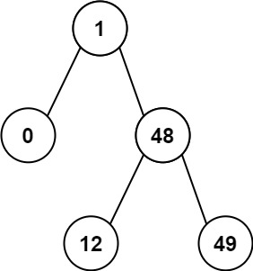

# Minimum Absolute Difference in BST

## Problem Statement

Given the `root` of a Binary Search Tree (BST), return the minimum absolute difference between the values of any two different nodes in the tree.

---

## Examples

### Example 1


**Input:**
```python
root = [4,2,6,1,3]
```

**Output:**
```python
1
```

---

### Example 2


**Input:**
```python
root = [1,0,48,null,null,12,49]
```

**Output:**
```python
1
```

---

## Constraints

- The number of nodes in the tree is in the range `[2, 10^4]`.
- `0 <= Node.val <= 10^5`.
