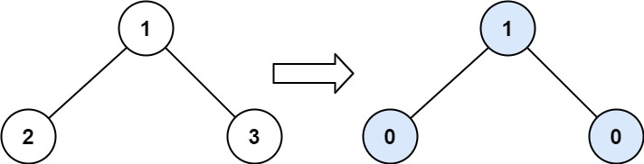
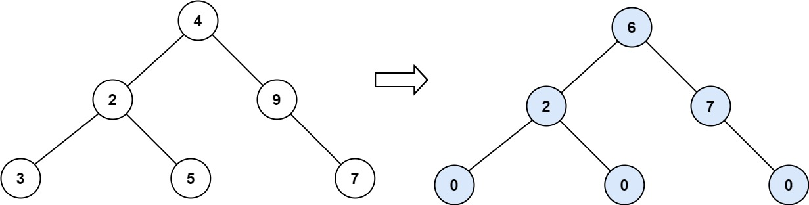
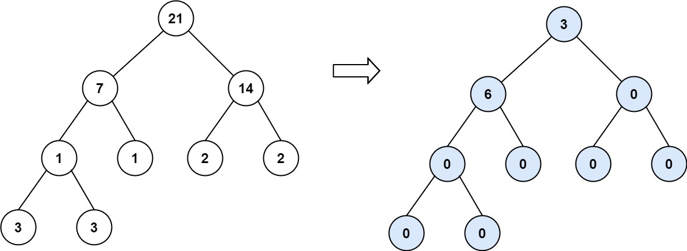

# Binary Tree Tilt

## Problem Statement

Given the **root** of a **binary tree**, return the sum of every tree node's **tilt**.

The **tilt** of a node is the **absolute difference** between:

- The sum of all node values in its **left subtree**.
- The sum of all node values in its **right subtree**.

If a node does not have a left or right child, treat the missing subtree sum as **0**.

---

## Examples

### Example 1:

**Input:**  
```plaintext
root = [1,2,3]
```
**Output:**  
```plaintext
1
```
**Explanation:**  
- Tilt of node `2`: `|0 - 0| = 0`
- Tilt of node `3`: `|0 - 0| = 0`
- Tilt of node `1`: `|2 - 3| = 1`
- **Total tilt** = `0 + 0 + 1 = 1`

---

### Example 2:

**Input:**  
```plaintext
root = [4,2,9,3,5,null,7]
```
**Output:**  
```plaintext
15
```
**Explanation:**  
- Tilt of node `3`: `|0 - 0| = 0`
- Tilt of node `5`: `|0 - 0| = 0`
- Tilt of node `7`: `|0 - 0| = 0`
- Tilt of node `2`: `|3 - 5| = 2`
- Tilt of node `9`: `|0 - 7| = 7`
- Tilt of node `4`: `|(3+5+2) - (9+7)| = |10 - 16| = 6`
- **Total tilt** = `0 + 0 + 0 + 2 + 7 + 6 = 15`

---

### Example 3:

**Input:**  
```plaintext
root = [21,7,14,1,1,2,2,3,3]
```
**Output:**  
```plaintext
9
```

---

## Constraints

- `0 <= number of nodes <= 10^4`
- `-1000 <= Node.val <= 1000`
