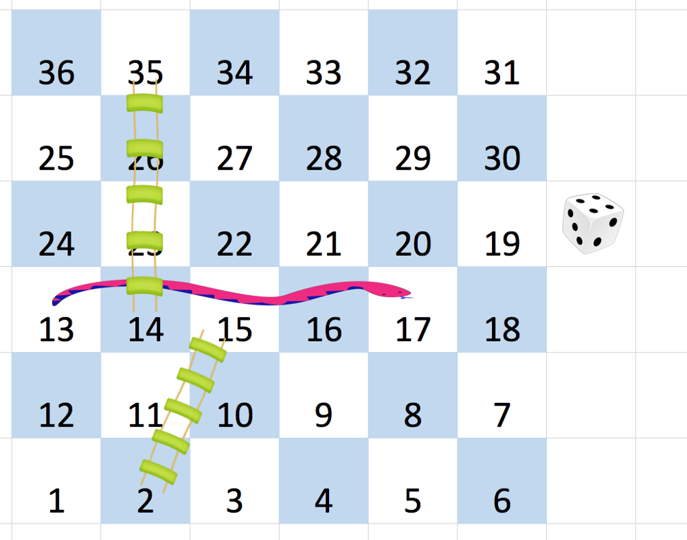

# Snakes and Ladders

## Problem Statement

You are given an `n x n` integer matrix `board` where:
- The cells are labeled from `1` to `n²` in a **Boustrophedon** style (alternating direction per row).
- The game starts at **square 1**.
- Each move simulates rolling a **6-sided die**, allowing movement from `curr` to any square in `[curr + 1, min(curr + 6, n²)]`.
- If a square contains a **ladder** (`board[r][c] > 0`), you must move to its destination.
- If a square contains a **snake** (`board[r][c] > 0`), you must move to its destination.
- The game ends when reaching **square n²**.
- Squares `1` and `n²` do **not** contain snakes or ladders.

### Goal:
Return the **minimum** number of dice rolls needed to reach `n²`. If it's **impossible**, return `-1`.

---

## Examples

### Example 1

**Input:**
```python
board = [
  [-1,-1,-1,-1,-1,-1],
  [-1,-1,-1,-1,-1,-1],
  [-1,-1,-1,-1,-1,-1],
  [-1,35,-1,-1,13,-1],
  [-1,-1,-1,-1,-1,-1],
  [-1,15,-1,-1,-1,-1]
]
```
**Output:**
```python
4
```

**Explanation:**
1. Start at **square 1**.
2. Move to **square 2** → **ladder** → **square 15**.
3. Move to **square 17** → **snake** → **square 13**.
4. Move to **square 14** → **ladder** → **square 35**.
5. Move to **square 36** (**goal reached**).

---

### Example 2

**Input:**
```python
board = [
  [-1,-1],
  [-1,3]
]
```
**Output:**
```python
1
```

**Explanation:**
1. Start at **square 1**.
2. Move to **square 2** → **ladder** → **square 3** (**goal reached**).

---

## Constraints

- `n == board.length == board[i].length`
- `2 <= n <= 20`
- `board[i][j]` is **either -1 or a number in `[1, n²]`**.
- Squares **1** and **n²** do **not** contain snakes or ladders.

