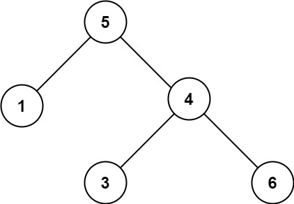

# Validate Binary Search Tree (BST)

## Problem Statement

Given the root of a binary tree, determine if it is a valid **Binary Search Tree (BST).**

A **valid BST** is defined as follows:

1. The **left subtree** of a node contains only nodes with keys **less than** the node's key.
2. The **right subtree** of a node contains only nodes with keys **greater than** the node's key.
3. Both the **left and right subtrees** must also be binary search trees.

---

## Examples

### Example 1:

**Input:**  
```plaintext
root = [2,1,3]
```
**Output:**  
```plaintext
true
```

### Example 2:

**Input:**  
```plaintext
root = [5,1,4,null,null,3,6]
```
**Output:**  
```plaintext
false
```
**Explanation:**  
The root node's value is `5`, but its right child's value is `4`, which violates the BST property.

---

## Constraints

- The number of nodes in the tree is in the range **[1, 10⁴]**.
- The value of each node is in the range **[-2³¹, 2³¹ - 1]**.
